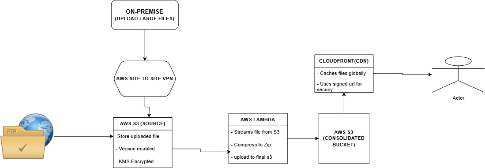

# AWS Infrastructure Setup with Terraform

This project sets up an AWS infrastructure using Terraform, including S3 buckets, a Lambda function, CloudFront distribution, and a VPN setup.

## Overview

The infrastructure includes:

- **S3 Buckets**: A source bucket and a consolidated bucket for storing processed files.
- **Lambda Function**: A function to zip and move files between S3 buckets.
- **CloudFront Distribution**: To serve files from the consolidated bucket.
- **IAM Roles & Policies**: To provide necessary permissions.
- **VPN Setup**: Includes Customer Gateway, Transit Gateway, and VPN connections.

## Infrastructure Components



### 1. **S3 Buckets**

- `source_bucket`: Stores raw files.
- `consolidated_bucket`: Stores zipped files after processing.

### 2. **AWS Lambda Function**

- Processes files uploaded to the `source_bucket`.
- Zips the file and moves it to the `consolidated_bucket`.

### 3. **CloudFront Distribution**

- Serves files from the `consolidated_bucket`.

### 4. **IAM Role & Policy**

- IAM roles grant necessary permissions to Lambda for accessing S3.

### 5. **VPN Setup**

- Configures a secure VPN connection using AWS Direct Connect and Transit Gateway.

## Deployment

### Prerequisites

- Install [Terraform](https://www.terraform.io/downloads).
- Configure AWS CLI with appropriate credentials.

### Steps

1. Clone this repository:

   ```sh
   git clone https://github.com/RichieTheDev/circu_project.git
   cd circu_project

   ```

2. Initialize Terraform:
   ```sh
   terraform init
   ```
3. Plan the deployment:
   ```sh
   terraform plan
   ```
4. Apply the configuration:
   ```sh
   terraform apply -auto-approve
   ```

## Outputs

- `source_bucket_name`: Name of the source S3 bucket.
- `consolidated_bucket_name`: Name of the consolidated S3 bucket.
- `lambda_function_arn`: ARN of the deployed Lambda function.
- `cloudfront_url`: CloudFront distribution domain name.
- `vpn_gateway_id`: ID of the created VPN Gateway.
- `customer_gateway_id`: ID of the Customer Gateway.

## Cleanup

To destroy the deployed resources, run:

```sh
terraform destroy -auto-approve
```

## Variables

Update `terraform.tfvars` with your specific details:

```hcl
source_bucket = "your-source-bucket"
consolidated_bucket = "your-consolidated-bucket"
lambda_function_name = "your-lambda-function"
customer_gateway_ip = "your-public-ip"
vpc_id = "your-vpc-id"
transit_gateway_id = "your-transit-gateway-id"

```
