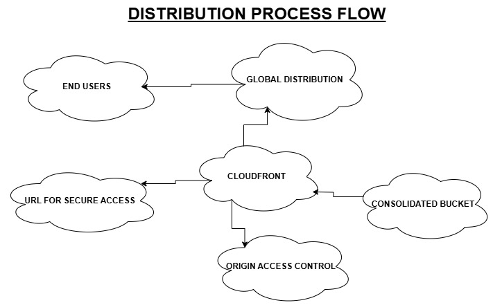
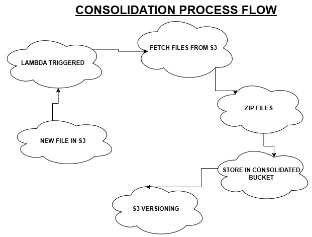
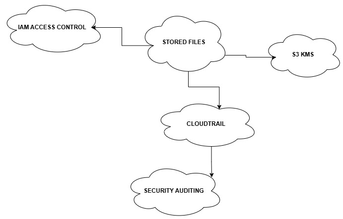
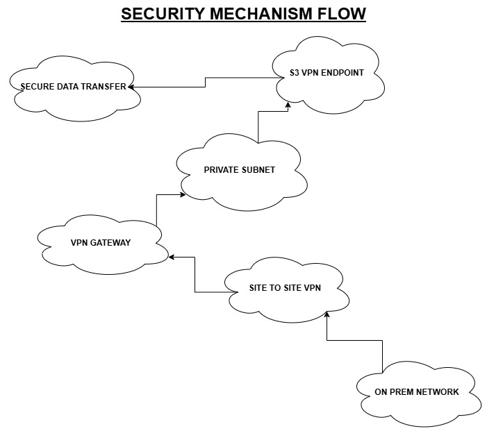
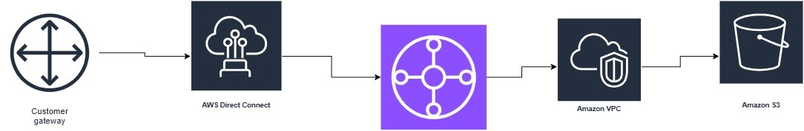

# AWS Infrastructure for Secure S3 Processing and CloudFront Distribution

## Overview

This project sets up a secure and automated AWS cloud infrastructure using **Terraform** to manage S3 file storage, CloudFront content distribution, and Lambda-based file processing. The infrastructure includes Identity and Access Management (IAM) roles, a Direct Connect VPN Gateway, and a Transit Gateway for secure network routing.

## Infrastructure Components


### 1. **Amazon S3** (Simple Storage Service)


- **Source Bucket**: Stores incoming files before processing.
- **Consolidated Bucket**: Stores processed (zipped) files.
- **Security Measures**:
  - Server-side encryption (kms) enabled for both buckets.
  - Public access is blocked.
  - Versioning enabled to retain file history and prevent accidental deletion.

### 2. **AWS CloudFront** (Content Delivery Network)



- Serves content securely from the **Consolidated S3 Bucket**.
- Uses an **Origin Access Control (OAI)** to restrict direct S3 access.
- Enables caching for performance optimization.

### 3. **AWS Lambda** (Serverless Processing)



- Automatically triggered on new uploads to the **Source Bucket**.
- Zips files and moves them to the **Consolidated Bucket**.
- Uses IAM roles and policies to limit access to S3 operations.

### 4. **IAM (Identity and Access Management)**



- **IAM Role for Lambda**: Grants permissions to access S3 buckets.
- **IAM Policies**:
  - Allows Lambda to read from the Source Bucket.
  - Allows Lambda to write to the Consolidated Bucket.
  - Restricts access to only necessary actions.

### 5. **AWS Networking (VPN and Transit Gateway)**



- **Site to Site VPN Gateway**: Establishes an ipsec encrypted tunnel between on prem and aws.
- **Transit Gateway**: Routes traffic between on-premises networks and AWS.
- **Customer Gateway**: Defines the on-premises VPN endpoint.

## Infrastructure as Code (IaC)

- The project is implemented using **Terraform**, ensuring:
  - Consistency across deployments.
  - Version control and rollback capabilities.
  - Automation for scalable and repeatable infrastructure setup.

## Benefits and Considerations

### **Infrastructure as Code (IaC)**

**Benefits:**

- Enables rapid deployment and consistent environments.
- Enhances version control and change tracking.
- Automates infrastructure provisioning.

**Potential Pitfalls:**

- Misconfigurations can lead to security risks.
- Requires a learning curve for teams unfamiliar with Terraform.

**Important Considerations:**

- Secure sensitive data (e.g., API keys) using parameter stores or secrets management tools.
- Implement CI/CD pipelines for testing IaC changes before deployment.

### **IoT and Edge Computing**

**Benefits:**

- Reduces latency by processing data closer to the source.
- Reduces bandwidth costs by filtering and preprocessing data before sending it to the cloud.

**Potential Pitfalls:**

- Limited processing power at edge devices can be a constraint. Synchronization issues may arise between cloud storage and edge nodes, leading to data inconsistency.

**Important Considerations:**

- Use lightweight models and efficient communication protocols (e.g., MQTT) for IoT devices.
- Implement security measures like encrypted data transmission and device authentication to prevent breaches.

### **Cost Calculation and Optimization**

**Benefits:**

- S3 storage and data transfer fees.
- Lambda execution time and memory usage.
- CloudFront caching reduces origin data transfer costs.

**Potential Pitfalls:**

- Over-provisioning storage, unnecessary API calls, and inefficient CloudFront caching policies can drive up costs.
- Not monitoring usage patterns may lead to unexpected expenses.

**Important Considerations:**

- Use AWS Cost Explorer and Budgets to track spending. Implement lifecycle policies to archive or delete stale data.
- Optimize CloudFront caching and leverage Reserved Instances where applicable.

## Deployment Instructions

1.  **Install Terraform**

    ```bash
    wget https://releases.hashicorp.com/terraform/1.5.0/terraform_1.5.0_linux_amd64.zip
    unzip terraform_1.5.0_linux_amd64.zip
    mv terraform /usr/local/bin/
    ```

    1b. **Clone from github**

        git clone https://github.com/RichieTheDev/circu_pro.git

# Deploying Lambda Function to S3

cd lambda_function

## Zip the Lambda Function Code

```sh
zip -r lambda_function.zip index.py
```

## Upload the Zipped Function to Your S3 Bucket

```sh
aws s3 cp lambda_function.zip s3://your-consolidated-bucket/
```

Replace `your-consolidated-bucket` with the actual name of your S3 bucket.

2. **Initialize Terraform**

   ```bash
   terraform init
   ```

3. **Plan the Deployment**

   ```bash
   terraform plan
   ```

4. **Apply the Deployment**
   ```bash
   terraform apply -auto-approve
   ```

## Outputs

- `source_bucket_name`: Name of the source S3 bucket.
- `consolidated_bucket_name`: Name of the consolidated S3 bucket.
- `lambda_function_arn`: ARN of the deployed Lambda function.
- `cloudfront_url`: CloudFront distribution domain name.
- `vpn_gateway_id`: ID of the created VPN Gateway.
- `customer_gateway_id`: ID of the Customer Gateway.

## Generate an RSA Key Pair for Signed URLs

- You need a public/private key pair to sign URLs.
- Run the following command to generate an RSA key pair:

```sh
openssl genrsa -out private_key.pem 2048
openssl rsa -pubout -in private_key.pem -out public_key.pem
```

## Cleanup

To destroy the deployed resources, run:

```sh
terraform destroy -auto-approve
```

## Variables

Update `terraform.tfvars` with your specific details:

```hcl
region = "your-region"
source_bucket       = "your-source-bucket"
consolidated_bucket = "your-consolidated-bucket"
lambda_function_name = "your-lambda-function"
source_bucket_arn       = "arn:aws:s3:::yoursourcearn"
consolidated_bucket_arn = "arn:aws:s3:::yourconsolidatedarn"
s3_origin_domain_name = "youroriginname"
```

## Conclusion

This project provides a **secure, automated, and scalable** cloud infrastructure leveraging AWS services. The combination of **CloudFront, S3, Lambda, and VPN networking** ensures high performance, cost efficiency, and security in managing and distributing data.

   
