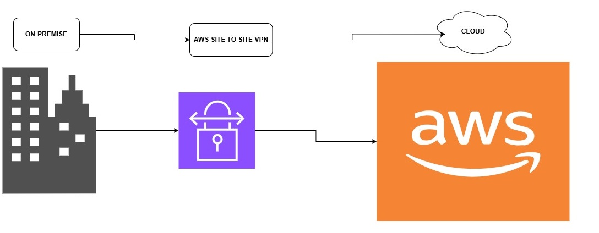
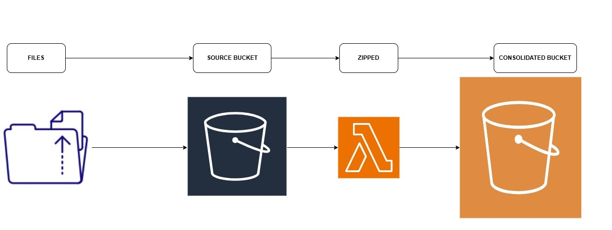
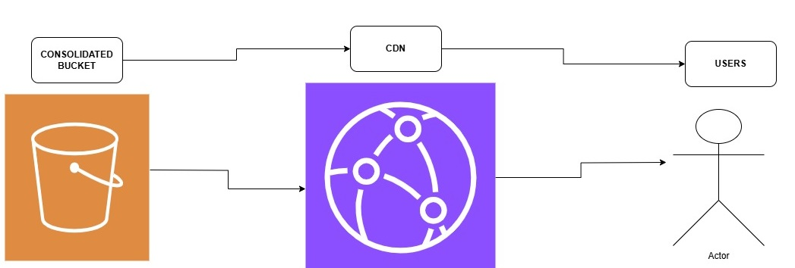

# AWS Infrastructure for Secure S3 Processing and CloudFront Distribution

## Overview

This project sets up a secure and automated AWS cloud infrastructure using **Terraform** to manage S3 file storage, CloudFront content distribution, and Lambda-based file processing. The infrastructure includes Identity and Access Management (IAM) roles, a Direct Connect VPN Gateway, and a Transit Gateway for secure network routing.

## Infrastructure Components


### 1. **Amazon S3** (Simple Storage Service)

- **Source Bucket**: Stores incoming files before processing.
- **Consolidated Bucket**: Stores processed (zipped) files.
- **Security Measures**:
  - Server-side encryption (AES-256) enabled for both buckets.
  - Public access is blocked.
  - Versioning enabled to retain file history and prevent accidental deletion.

### 2. **AWS CloudFront** (Content Delivery Network)

- Serves content securely from the **Consolidated S3 Bucket**.
- Uses an **Origin Access Identity (OAI)** to restrict direct S3 access.
- Enforces HTTPS and enables caching for performance optimization.

### 3. **AWS Lambda** (Serverless Processing)

- Automatically triggered on new uploads to the **Source Bucket**.
- Zips files and moves them to the **Consolidated Bucket**.
- Uses IAM roles and policies to limit access to S3 operations.

### 4. **IAM (Identity and Access Management)**

- **IAM Role for Lambda**: Grants permissions to access S3 buckets.
- **IAM Policies**:
  - Allows Lambda to read from the Source Bucket.
  - Allows Lambda to write to the Consolidated Bucket.
  - Restricts access to only necessary actions.

### 5. **AWS Networking (VPN and Transit Gateway)**

- **Direct Connect Gateway**: Establishes a dedicated network connection to AWS.
- **Transit Gateway**: Routes traffic between on-premises networks and AWS.
- **Customer Gateway**: Defines the on-premises VPN endpoint.

## Infrastructure as Code (IaC)

- The project is implemented using **Terraform**, ensuring:
  - Consistency across deployments.
  - Version control and rollback capabilities.
  - Automation for scalable and repeatable infrastructure setup.

## Benefits and Considerations

### **Infrastructure as Code (IaC)**

**Benefits:**

- Enables rapid deployment and consistent environments.
- Enhances version control and change tracking.
- Automates infrastructure provisioning.

**Potential Pitfalls:**

- Misconfigurations can lead to security risks.
- Requires a learning curve for teams unfamiliar with Terraform.

### **IoT and Edge Computing**

**Benefits:**

- Reduces latency by processing data closer to the source.
- Reduces bandwidth costs by filtering and preprocessing data before sending it to the cloud.

**Considerations:**

- Requires security measures to prevent unauthorized access.
- Edge devices may have limited processing power.

### **Cost Calculation and Optimization**

**Cost Factors:**

- S3 storage and data transfer fees.
- Lambda execution time and memory usage.
- CloudFront caching reduces origin data transfer costs.
- Direct Connect pricing for dedicated network connections.

**Optimizations:**

- Enabling compression and caching in CloudFront reduces data transfer costs.
- Using lifecycle policies in S3 to transition old files to **Glacier** for lower-cost archival storage.
- Optimizing Lambda execution time and memory allocation to reduce compute costs.

## Deployment Instructions

1. **Install Terraform**

   ```bash
   wget https://releases.hashicorp.com/terraform/1.5.0/terraform_1.5.0_linux_amd64.zip
   unzip terraform_1.5.0_linux_amd64.zip
   mv terraform /usr/local/bin/
   ```
1b. **Clone from github**
    
    ```bash
    git clone https://github.com/RichieTheDev/circu_pro.git
    ```

2. **Initialize Terraform**

   ```bash
   terraform init
   ```

3. **Plan the Deployment**

   ```bash
   terraform plan
   ```

4. **Apply the Deployment**
   ```bash
   terraform apply -auto-approve
   ```

## Outputs

- `source_bucket_name`: Name of the source S3 bucket.
- `consolidated_bucket_name`: Name of the consolidated S3 bucket.
- `lambda_function_arn`: ARN of the deployed Lambda function.
- `cloudfront_url`: CloudFront distribution domain name.
- `vpn_gateway_id`: ID of the created VPN Gateway.
- `customer_gateway_id`: ID of the Customer Gateway.

## Cleanup

To destroy the deployed resources, run:

```sh
terraform destroy -auto-approve
```

## Variables

Update `terraform.tfvars` with your specific details:

```hcl
region = "your-region"
source_bucket       = "your-source-bucket"
consolidated_bucket = "your-consolidated-bucket"
lambda_function_name = "your-lambda-function"
source_bucket_arn       = "arn:aws:s3:::yoursourcearn"
consolidated_bucket_arn = "arn:aws:s3:::yourconsolidatedarn"
customer_gateway_ip  = "yourcustomerip"
customer_gateway_asn = "yourcustomerasn"
vpc_id               = "yourvpcid"
allowed_prefixes     = ["youriprange"]
dx_gateway_id        = ""
transit_gateway_id   = ""
s3_origin_domain_name = "youroriginname"
```

## Conclusion

This project provides a **secure, automated, and scalable** cloud infrastructure leveraging AWS services. The combination of **CloudFront, S3, Lambda, and VPN networking** ensures high performance, cost efficiency, and security in managing and distributing data.

  
